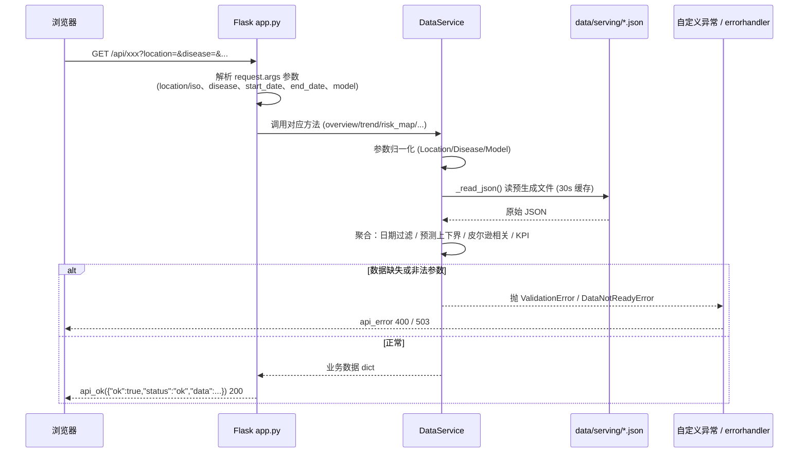

# 疾病趋势平台 — Flask 与 ECharts 应用分析与流程图

> 分析对象：`src/web/`（Flask 后端 + ECharts 前端）
> 结论速览：单文件扁平 Flask 应用（无 Blueprint、无运行时数据库），后端在请求期只读取 `data/serving/*.json` 预生成文件；前端用 CDN 引入 ECharts 5，通过 `fetch` 调 16 个 `/api/*` 端点并渲染 10 个图表。

---

## 一、整体架构与数据流

```mermaid
flowchart TB
    subgraph 离线生产层[离线数据生产层 - 不在请求路径内]
        EXT[外部数据源<br/>WHO / 中国CDC / Open-Meteo]
        COL[采集脚本 src/collectors/*<br/>who_collector / china_cdc / open_meteo]
        RAW[(data/raw 原始数据)]
        SPARK[Spark 作业 src/spark_jobs/*<br/>清洗 / 特征 / 训练 GBDT+LSTM]
        PAR[(parquet 特征与预测)]
        EXPORT[导出脚本<br/>export_dashboard.py / generate_demo_data.py<br/>build_local_serving_from_raw.py]
        SERVING[(data/serving/*.json<br/>overview / trend / risk_map / rankings<br/>model_metrics / predictions / weather_correlation<br/>disease_share / source_status ...)]
        EXT --> COL --> RAW --> SPARK --> PAR --> EXPORT --> SERVING
    end

    subgraph 在线服务层[在线请求路径 - 用户触发]
        BROWSER[浏览器 打开 /]
        INDEX[index.html<br/>CDN 引入 echarts@5]
        APPJS[app.js bootstrap()]
        FLASK[Flask app.py<br/>16 个 @app.get 路由]
        SVC[DataService 单例<br/>_read_json 带 30s mtime 缓存]
        BROWSER --> INDEX --> APPJS
        APPJS -->|fetch /api/*| FLASK
        FLASK --> SVC
    end

    SERVING -. 运行时只读 .-> SVC
    FLASK -->|统一 {ok,data} JSON| APPJS
    APPJS -->|setCharts 调用| CHARTS[charts.js<br/>10 个 option 构造函数]
    CHARTS -->|setOption| ECHARTS[ECharts 渲染 10 个图表]
```

---

## 二、Flask 请求处理流程



### 路由总表（全部 GET，统一 {ok,data} 响应）

| 路由 | 处理函数 | 读取的 serving 文件 | 说明 |
|------|----------|---------------------|------|
| `/` | `index()` | — | 渲染 `index.html` |
| `/api/health` | `health()` | overview, metadata | 健康检查 |
| `/api/overview` | `overview()` | overview, options, trend, risk_map, model_metrics | KPI 概览 |
| `/api/trend` | `trend()` | trend, options | 趋势/移动平均/T+7 预测 |
| `/api/risk-map` | `risk_map()` | risk_map | 风险散点 |
| `/api/rankings` | `rankings()` | rankings | 高风险排行 |
| `/api/model-metrics` | `model_metrics()` | model_metrics, model_comparison | MAE/RMSE |
| `/api/data-quality` | `data_quality()` | data_quality_report | 完整率仪表盘 |
| `/api/options` | `options()` | options | 下拉框选项 |
| `/api/predictions` | `predictions()` | predictions | 预测值与误差 |
| `/api/weather-correlation` | `weather_correlation()` | weather_correlation | 温湿度相关 |
| `/api/disease-share` | `disease_share()` | disease_share | 疾病占比饼图 |
| `/api/source-status` | `source_status()` | source_status | 数据源状态 |
| `/api/who-indicators` | `who_indicators()` | who_indicator_summary | WHO 指标利用 |
| `/api/model-coverage` | `model_coverage()` | model_data_coverage | 模型覆盖 |

错误处理：`ValidationError→400`、`DataNotReadyError→503`、`PlatformError→500`、`Exception→500`，均返回 `api_error`。

---

## 三、前端 ECharts 渲染流程

```mermaid
flowchart TB
    START[页面加载 index.html] --> LOADJS[按序加载<br/>api.js → charts.js → particles.js → app.js]
    LOADJS --> INIT[app.js bootstrap()]
    INIT --> OPT[loadOptions()<br/>fetch /api/options]
    OPT --> FILL[填充疾病/地区/模型/日期下拉框]
    INIT --> REFRESH[refreshDashboard()<br/>Promise.all 并行 fetch]

    REFRESH --> GET1[apiGet /api/overview]
    REFRESH --> GET2[apiGet /api/trend]
    REFRESH --> GET3[apiGet /api/risk-map]
    REFRESH --> GET4[apiGet /api/rankings]
    REFRESH --> GET5[loadWeatherCorrelation → /api/weather-correlation]
    REFRESH --> GET6[apiGet /api/model-metrics]
    REFRESH --> GET7[apiGet /api/data-quality]
    REFRESH --> GET8[apiGet /api/disease-share]
    REFRESH --> GET9[apiGet /api/predictions]
    REFRESH --> GET10[apiGet /api/source-status]

    GET1 --> KPI[renderKpis() 顶部 6 个卡片]
    GET2 --> SET[setCharts(data)]
    GET3 --> SET
    GET4 --> SET
    GET5 --> SET
    GET6 --> SET
    GET7 --> SET
    GET8 --> SET
    GET9 --> SET
    GET10 --> SRC[renderSources() 数据源列表]

    SET --> C1[trendChart ← lineTrendOption]
    SET --> C2[riskMapChart ← riskMapOption]
    SET --> C3[avgChart ← avgOption]
    SET --> C4[rankingChart ← rankingOption]
    SET --> C5[weatherChart ← weatherOption]
    SET --> C6[modelChart ← modelOption]
    SET --> C7[qualityChart ← qualityOption]
    SET --> C8[growthChart ← growthOption]
    SET --> C9[shareChart ← shareOption]
    SET --> C10[errorChart ← errorOption]

    C1 --> R[chart.setOption()] --> ECH[ECharts 渲染]
    C2 --> R
    C3 --> R
    C4 --> R
    C5 --> R
    C6 --> R
    C7 --> R
    C8 --> R
    C9 --> R
    C10 --> R

    USER[用户改筛选 / 点刷新] --> REFRESH
```

### 图表 → 端点 → option 函数映射

| 容器 ID | 图表类型 | option 函数 | 数据端点 |
|---------|----------|-------------|----------|
| `trendChart` | 折线/柱状 + 预测虚线 + 参考区间 + dataZoom | `lineTrendOption` | `/api/trend` |
| `riskMapChart` | 经纬度散点（visualMap 着色） | `riskMapOption` | `/api/risk-map` |
| `avgChart` | 折线（移动平均） | `avgOption` | `/api/trend` |
| `rankingChart` | 横向柱状 | `rankingOption` | `/api/rankings` |
| `weatherChart` | 散点（visualMap 按湿度着色） | `weatherOption` | `/api/weather-correlation` |
| `modelChart` | 柱状（MAE/RMSE 并列） | `modelOption` | `/api/model-metrics` |
| `qualityChart` | 仪表盘 gauge | `qualityOption` | `/api/data-quality` |
| `growthChart` | 折线（增长率） | `growthOption` | `/api/trend` |
| `shareChart` | 环形饼图 pie | `shareOption` | `/api/disease-share` |
| `errorChart` | 柱状（预测误差，正负分色） | `errorOption` | `/api/predictions` |

> 注意：`riskMapChart` 是**自定义经纬度散点图**（x 轴经度 -180~180，y 轴纬度 -60~80），并非中国/世界地理地图组件。ECharts 通过 CDN 引入，非本地打包。

---

## 四、关键结论

1. **后端极简**：单一 `app.py`，16 个 `@app.get` 路由全部挂在 `app` 上，无 Blueprint；`DataService` 单例在请求期只读 `data/serving/*.json`（30s mtime 缓存），**不连 Hive/HDFS/数据库**，Spark/HDFS 连接仅存在于离线采集与流水线脚本。
2. **前端分层清晰**：`api.js`（fetch 封装）、`charts.js`（option 构造函数）、`app.js`（编排）、`particles.js`（时钟）。`refreshDashboard()` 用 `Promise.all` 并行拉取 10 个端点。
3. **渲染解耦**：所有图表由 `setCharts()` 把各端点数据传给 `charts.js` 的纯函数生成 `option`，再 `chart.setOption()`。
4. **统一契约**：所有 API 返回 `{ok, status, data, error}`，前端 `apiGet` 统一校验 `ok` 字段。
